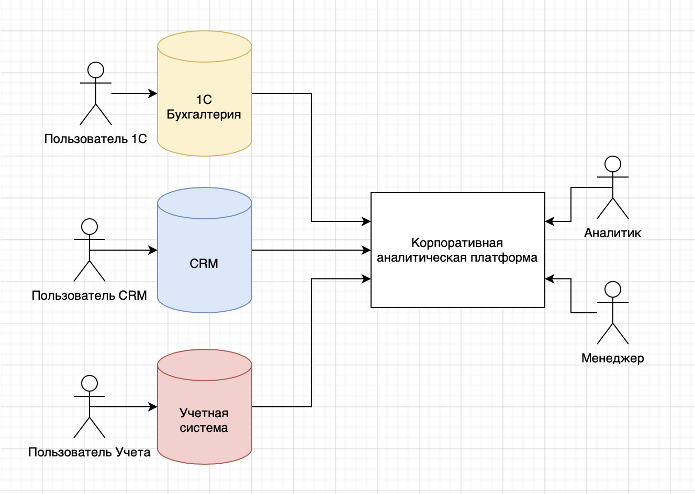
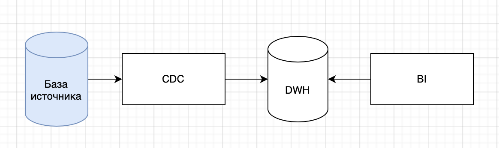
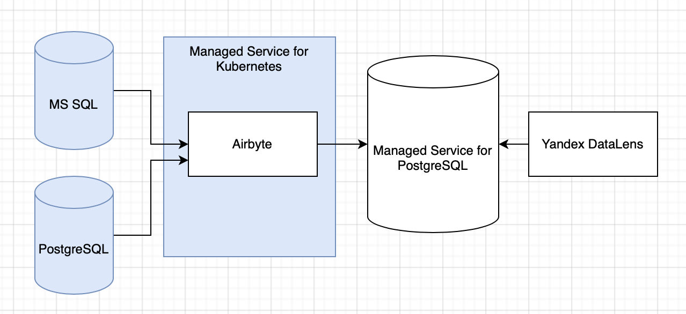
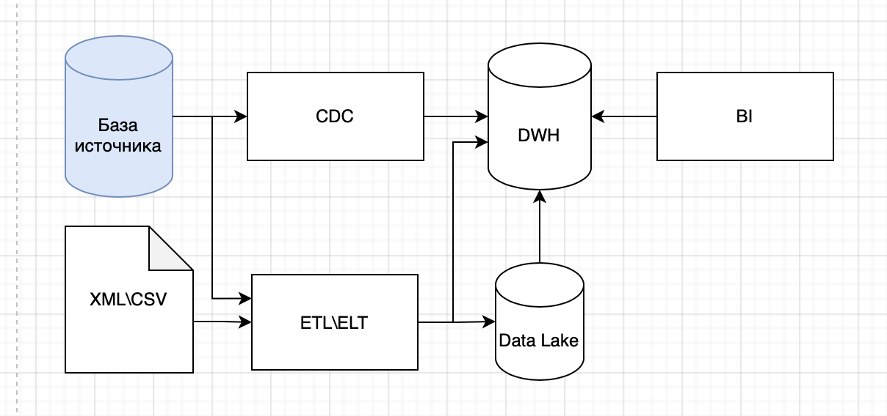
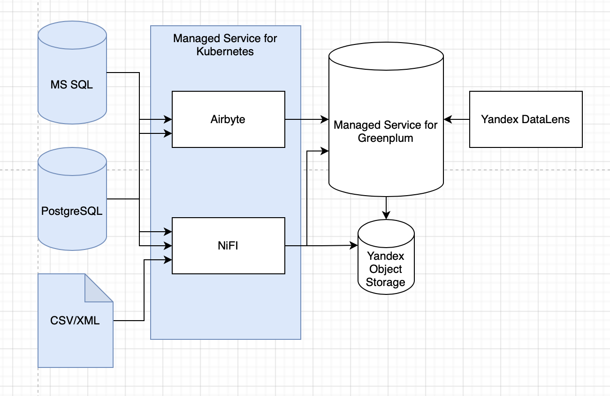
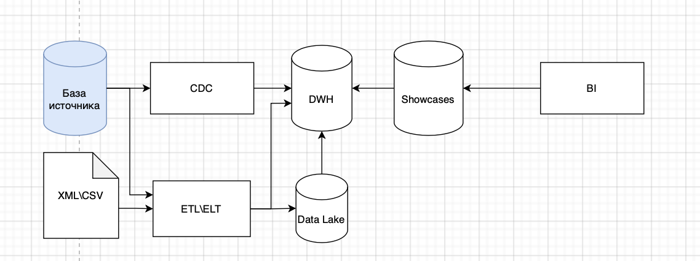
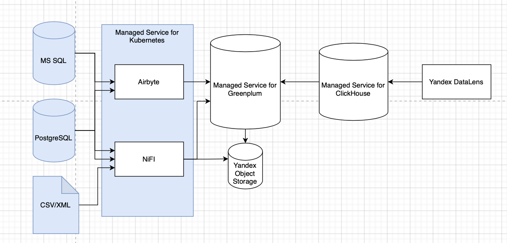

# dwh-architecture

## Бизнес-кейс

ООО "Финтех" - молодая, динамично развивающаяся компания. Основной вид деятельности - кредитование малого и среднего бизнеса. Большая часть процессов компании автоматизирована с помощью разничных ИТ-систем, и каждая из них предлагает собственные функции формирования отчетности. Но с ростом бизнеса стало ясно, что для принятия верных управленческих решений требуется общая корпоративная аналитическая платформа.

**Бизнес-драйверы**

 * Низкий уровень зрелости работы с данными
 * Высокие трудозатраты на формирование отчетности
 * Невозможность принять своевременное и качественное управленческое решение

**Бизнес-цели**

 * Централизовать функцию хранения, обработки и визуализации данных для принятия data-driven решений

## Требования

### Заинтересованные лица

* **Бизнес-аналитик**
  - Первый и самый активный пользователь целевой системы. 
  - Для аналитика важно, чтобы ему были доступны все данные по компании в одном месте.
  - Хочется самостоятельно формировать OLAP-кубы, отчеты, дешборды.

* **Менеджер**
  - В обязанности менеджера входит формировать отчетность по своему подразделению.
  - Хочет формировать ad-hoc отчеты, но не прикладывать для этого слишком много усилий.
  - Не должен видеть данные других отделов.
  
* **Топ-менеджер**
  - Руководитель хочет "держать руку на пульсе".
  - Хочет периодически смотреть на дешборды, чтобы понимать, как идут дела. Сам отчеты не формирует.
  
* **Архитектор**
  - Хочет отделить аналитическую функцию от сервисов, для которых отчеты - не целевая функциональность.
  - Желает избежать вендор-лока и появления команды (сервиса) - потенциального бутылочного горлышка.
  
  
### Функциональные требования

* Возможность формировать аналитическую отчетность по всем имеющимся данным в компании
* Возможность управлять правами доступа к датасетам, витринам, отчетам, дешбордам
* Self-service: менеджеры должны сами формировать себе отчеты без заявки в ИТ-отдел
* Возможность автоматически отправлять отчеты на почту
* Возможность добавлять новые источники данных

### Архитектурные требования

* Актуальность данных - как можно ближе к real-time
* Время формирования отчета - не более часа
* Время открытия дешборда - не более 10 секунд
* Срок хранения данных - 5 лет
* Доступность - 99%

### Дополнительный контекст

* Компания использует Яндекс.Облако как основую площадку для размещения своих сервисов.
* В компании отсутствуют специалисты по работе с данными.
* Нет видения того, какие именно требуются отчеты/витрины, а так же предполагаемого объема и характера данных. Предполагается определить это в процессе.
* Нет пожеланий по тому, какая именно система будет использована для визуализации, но требуется поддержка русского языка.

## Целевая архитектура

Предлагается реализовать Корпоративную платформу аналитики, состоящую из 3 компонентов: DWH - хранилище данных, ETL/ELT - средство миграции данных из источников в DWH, и BI - инструмент для визуализации данных.

В связи с санкционными рисками и ограничениями бюджета, платные решения не рассматривались.

**Контекст системы**

Платформу рекомендуется внедрять в 3 этапа.

### Stage 1. Базовый DWH

Из базы источника данные переносятся в DWH с помощью логической репликации. BI-инструмент подключен к DWH напрямую.
На данном этапе компания знакомится с BI, конкретнее формулируются потребности, выявляются "проблемные" данные и источники.
CDC позволит не озадачиваться вопросами трансформации данных, так как в источниках данные структурированы и теоретически готовы к аналитике.
Минимизирован риск навредить базе-источнику. Недорогая база данных под DWH позволит сэкономить средства на время этого "тестового" периода.

#### Компоненты

#### Контейнеры

Ниже приведены обоснования решений:

 - [ADR-1](ADR/ADR-1-datalens.md) Использование DataLens в качестве BI-системы.
 - [ADR-2](ADR/ADR-2-postgresql.md) Использование PostgreSQL в качестве DWH.
 - [ADR-3](ADR/ADR-3-airbyte.md) Использование Airbyte в качестве CDC-платформы.
 
 
### Stage 2. Продвинутый DWH

Применяется, когда:
* Недостаточно производительности PostgreSQL
* Очевидна потребность в трансформации, очистке и дедупликации данных
* Требуется работать с неструктурированными данными

Добавлены процессы ETL\ELT и хранение слабоструктурированных данных. На данном этапе потребуется как минимум 1 FTE Data-инжинер для разработки и поддержки пайплайнов обработки данных.

#### Компоненты

#### Контейнеры

 - [ADR-4](ADR/ADR-4-greenplum.md) Смена DWH с PostgreSQL на Greenplum.
 - [ADR-5](ADR/ADR-5-s3.md) Использование S3 для хранения неструктурированных данных.
 - [ADR-6](ADR/ADR-6-nifi.md) Использование NiFi как ETL/ELT-инструмента.

### Stage 3. DWH мечты

Четко сформировались требования к тому, какие витрины необходимы компании и не хватает производительности Greenplum.

#### Компоненты

#### Контейнеры

 - [ADR-7](ADR/ADR-7-clickhouse.md) Использование ClickHouse для работы с витринами данных.
 
 
## Анализ

### Оценка стоимости

##### 1 FTE Data Engineer - 3_000_000 в год
##### 0.5 FTE DevOps - 2_000_000 в год
##### Инфраструктура stage 1 - 200_000 в год
##### Инфраструктура stage 2 - 2_000_000 в год
##### Инфраструктура stage 3 - 4_000_000 в год

### Оценка сроков

##### Имплементация stage 1 - 1 релиз
##### Имплементация stage 2 - 2-3 релиза
##### Имплементация stage 3 - 1 релиз

##### Общий срок проекта - 1 год (6 релизов)

### Оценка рисков

Общий уровень риска проекта характеризуется как низкий.
 
 
